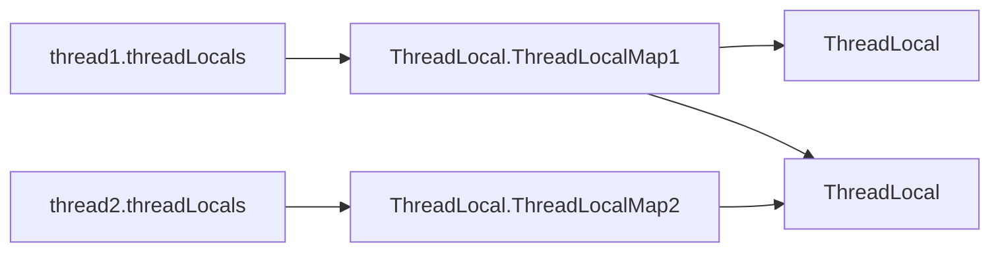

# ThreadLocal的原理[👉processon](https://www.processon.com/view/link/65ddaae7dac0d247a4efc833)

## 特性
### 1.和线程的关系
ThreadLocal有一个内部类ThreadLocal.ThreadLocalMap，这个map的key是ThreadLocal实例，value是用户设置的任意类型的值，ThreadLocal就是
一个包含一系列操作ThreadLocal.ThreadLocalMap方法的载体,正因为此我们常常将ThreadLocal定义成静态的(使用static修饰)，这有点类似spring
的单例bean，因为仅仅是众多方法的载体，所以不需要重复创建。在线程Thread有一个ThreadLocal.ThreadLocalMap类型的属性threadLocals，线程在
执行过程中，调用ThreadLocal的set方法会将一个entry放入到当前线程的threadLocals中，我们可以调用不同ThreadLocal的set方法，这样当前线程的
的threadLocals就会有多个entry。针对不同类型的值，推荐使用不同的ThreadLocal，ThreadLocal的泛型就约束了我们放入/取出值的类型。


### 2.ThreadLocalMap键的hash值
```text
private static int nextHashCode() {
    return nextHashCode.getAndAdd(HASH_INCREMENT);
}
private static AtomicInteger nextHashCode =  new AtomicInteger();
private static final int HASH_INCREMENT = 0x61c88647;
```
hash值的计算是从0开始累加0x61c88647，注意nextHashCode是一个static变量，这意味着在整个jvm是共享的，ThreadLocalMap的数组是2的n次幂 （
默认值是16），还有一个经过精心设计的步长HASH_INCREMENT，这就保证了计算出来槽的位置总是能够均匀分布的。

### 3.ThreadLocalMap处理hash碰撞
上面我们提到，一个线程在执行过程中，如果在不同地方调用不同的ThreadLocal.set方法，那么这个线程的ThreadLocalMap中就会有多个entry，这就必然
会产生hash碰撞的问题。ThreadLocalMap通过设计精心设计的数组的长度和hash值计算来保证计算健的槽位置总是能够均匀分布的，均匀分布的另一重意思
就是命中槽相邻的槽是空的。ThreadLocalMap在发生hash碰撞时，会将发生碰撞的键放到碰撞点的下一个槽中，在获取的时候也比较高效的，不需要遍历整个
数组，只需要从碰撞点往下遍历就可以了。