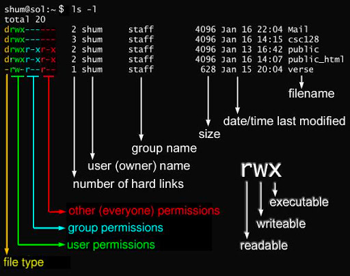

# linux文件权限
## 一. 简介
- Linux 系统是一种典型的多用户系统，不同的用户处于不同的地位，拥有不同的权限。
- 为了保护系统的安全性，Linux 系统对不同的用户访问同一文件（包括目录文件）的权限做了不同的规定。
- linux的文件权限有三种可读，可写、可执行，分别用小写字母r、w和x表示。
- linux的用户也有三类，文件所有者、文件所有者同组用户和其他用户，分别用小写字母u（user）、g（group）和o（other）表示。

## 二. 查看文件的权限
```text
% ls -l
```
```
drwxr-x---    3 jiangjunqing  staff        96  6 14 11:34 sys
-rw-r-----    1 jiangjunqing  staff  16777216  6 14 11:36 undo_001
-rw-r-----    1 jiangjunqing  staff  16777216  6 14 11:36 undo_002
```
详细解释看下图：



第一列第0位表示文件类型，可选值有以下几种：
- 当为 d，则是目录；
- 当为 -，则是文件；
- 若是 l，则表示为链接文档(link file)；
- 若是 b，则表示为装置文件里面的可供储存的接口设备(可随机存取装置)；
- 若是 c，则表示为装置文件里面的串行端口设备，例如键盘、鼠标(一次性读取装置)。

第一列第1-3位一次表示文件拥有者对文件的读（r）、写（w）和执行（x）权限， -表示无对应的权限。

第一列第4-6位一次表示文件所属组用户对文件的读（r）、写（w）和执行（x）权限， -表示无对应的权限。

第一列第7-9位一次表示其他用户对文件的读（r）、写（w）和执行（x）权限， -表示无对应的权限。

后面几列：第二列表示该文件硬链接的数据；第三列表示该文件的所有者名字；第四列表示该文件的所属组的名字，第五列表示文件的大小（字节）；
后面两部分代表文件最后更新的时间和文件的名称。

## 三. 修改文件的归属
我们已经知道文件的用户有三类，我们可以更改用户的归属到具体的用户或者具体的用户组

- 更新文件的所属组
```text
chgrp [-R] 属组名 文件名
#-R 表示递归更改，加上将同时更改该文件下的所有文件
```
- 更改文件的所有着用户
```text
chown [–R] 属主名 文件名
chown [-R] 属主名：属组名 文件名
# chown也可以更改文件所属用户组
```

## 四. 修改文件的用户权限
上面我们知道了文件有三种权限，r、w和x，其实也可以用数字代替，其中r=4，w=2，x=1，每种类别的权限都可以用一个数字代替，
所以754就对应了rwxr-xr--， 其中7=4+2+1， 5=4+0+1， 4=4+0+0。
```text
 chmod [-R] xyz 文件名
 # xyz表示上面的754三个数字
```
还一种是通过符号更改的，从上面我们已经知道，文件所有者、文件所有者同组用户和其他用户，分别用小写字母u（user）、g（group）和o（other）表示,
linux为了方便起见，a（all）代表前面的三种。
```text
chmod u=rwx,g=rx,o=r 文件名；
chmod a=rwx 文件名；#将文件三类用户权限都更改位rwx
```
还一种是通过+-符号来更改文件权限，其中+等于增加某种权限，-等于去掉某种权限
```text
chmod u+x 文件名；# 对文件的所有者用户（u）增加可执行权限（x）
chmod a-w 文件名；对文件的三类用户去除可执行权限（w）
```

## 五. 参考资料
[菜鸟教程-linux文件权限](https://www.runoob.com/linux/linux-file-attr-permission.html)