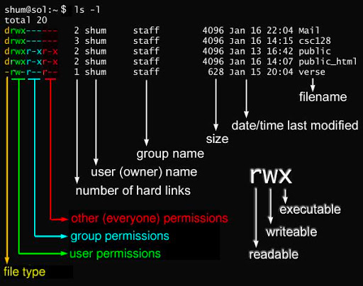

# linux文件权限
## 一. 简介
- Linux 系统是一种典型的多用户系统，不同的用户处于不同的地位，拥有不同的权限。
- 为了保护系统的安全性，Linux 系统对不同的用户访问同一文件（包括目录文件）的权限做了不同的规定。
- linux的文件权限有三种可读，可写、可执行，分别用小写字母r、w和x表示。
- linux的用户也有三类，文件所有者、文件所有者同组用户和其他用户，分别用小写字母u（user）、g（group）和o（other）表示。

## 二. 查看文件的权限
```text
% ls -l
```
```
drwxr-x---    3 jiangjunqing  staff        96  6 14 11:34 sys
-rw-r-----    1 jiangjunqing  staff  16777216  6 14 11:36 undo_001
-rw-r-----    1 jiangjunqing  staff  16777216  6 14 11:36 undo_002
```
详细解释看下图：



第0位表示文件类型，可选值有以下几种：
- 当为 d，则是目录
- 当为 -，则是文件；
- 若是 l，则表示为链接文档(link file)；
- 若是 b，则表示为装置文件里面的可供储存的接口设备(可随机存取装置)；
- 若是 c，则表示为装置文件里面的串行端口设备，例如键盘、鼠标(一次性读取装置)。
## 三. 修改文件的归属
我们已经知道文件的用户有三类，我们可以更改用户的归属到具体的用户或者具体的用户组

## 四. 修改文件的用户权限