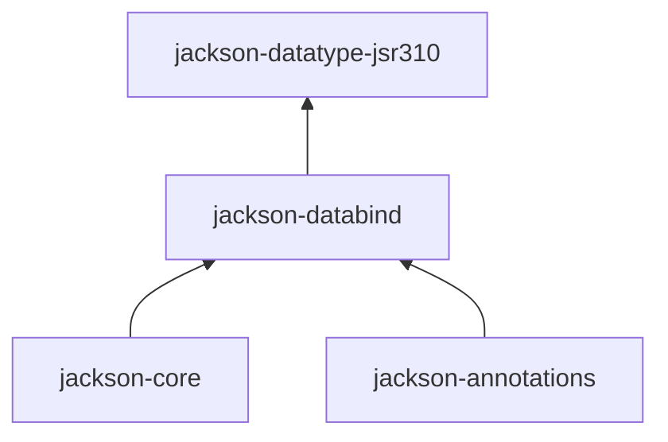
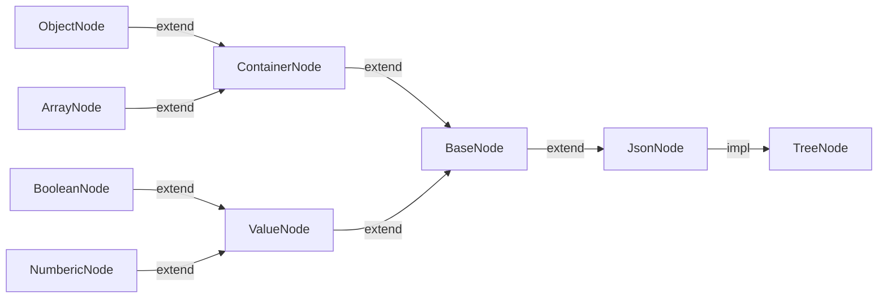

## 简介
jackson是spring默认支持的json序列化工具, 通常来说, 核心的三个jar包:`jackson-core`,`jackson-annotations`,`jackson-databind`,还有包括支持不同数
据类型的插件,比如jdk8中的时间格式(如LocalDate,LocalDateTime等)的插件`jackson-datatype-jsr310`等等,他们的依赖关系如图:

所以原则上来说,我们只要引入jackson-datatype-jsr310的jar包就行了,实际项目说,核心的三个包需不需要声明式的重复引入,取决于所在项目或者公司的规范,
不过遵照单一性原则,个人喜欢每个jar包都声明式的引入,当然,如果是接口-服务(api-service)分离的项目,在接口层,我们往往只需要引入`jackson-annotations`即可.

## jackson的使用
```java
//先定义两个pojo类
//POJO
@Setter
@Getter
@AllArgsConstructor
@NoArgsConstructor
public static class User {
    private String name;
    private Integer age;
    private Car car;
}

//POJO
@Setter
@Getter
@AllArgsConstructor
@NoArgsConstructor
public static class Car {
    private String name;
    private String brand;
}
```
### 最简单序列化
```groovy
ObjectMapper objectMapper = new ObjectMapper;
User walkvoid = new User("walkvoid", 18, new Car("my baby cat", "benz"));

//result is a string variable
String walkvoid1 = objectMapper.writeValueAsString(walkvoid);
// {"name":"walkvoid","age":18,"car":{"name":"my baby cat","brand":"benz"}}


//wirite json to file
objectMapper.writeValue(new File("/path/destination-fileName.txt"), walkvoid);
```
jackson根据输出的不同,可以将json结果作为字符串输出,写到文件中或者写到输出流中等等.

### 最简单反序列化
```groovy
String walkvoidJson = "{\"name\":\"walkvoid\",\"age\":18,\"car\":{\"name\":\"my baby cat\",\"brand\":\"benz\"}}";

//json to java bean
User user = objectMapper.readValue(walkvoidJson, User.class);

//json to list
String listJson = "[\"A\", \"B\", \"C\"]";
List list = objectMapper.readValue(listJson, List.class);

//java bean's json to map
Map<String, Object> map = objectMapper.readValue(walkvoidJson, Map.class);
//map instanceof LinkedHashMap, map.get("car") also instanceof LinkedHashMap


//json to tree
JsonNode jsonNode = objectMapper.readTree(walkvoidJson);
//jsonNode instanceof ObjectNode, jsonNode is root node
JsonNode brandNode = jsonNode.at("/car/brand");
String s = brandNode.asText();
//s == "benz"
```
jackson可以将json字符串反序列化成java bean, List或者Map,甚至还可以反序列化为最基础的树结构JsonNode,此时返回的是树的根节点,jackson支持文件
路径式的访问该树下的任意节点,正如你所看到上述例子中的"/car/brand",其中最开始的"/"表示根节点.
JsonNode是一个抽象类,其类图如下:


### 控制反序列化
上面的例子中,将一个json反序列化为java pojo时,实例化pojo时默认会调用该pojo类的空参构造方法,属性赋值默认使用set方法.当然我们可以自定义实例化方法.
使用自定义的创建器后,属性赋值就不用依赖set方法了, 看例子:
```java 
@Setter
//@Getter
@AllArgsConstructor
@NoArgsConstructor
public static class User {
    private String name;
    private Integer age;
    private Car car;

    @JsonCreator
    public User(@JsonProperty(value = "name") String name,
                @JsonProperty("age")Integer age,
                @JsonProperty(value = "car.name")String benzCarName) {
        this.name = name;
        this.age = age;
        this.car = new Car(benzCarName, "benz");
    }
}
```
```groovy
String walkvoidJson = "{\"name\":\"walkvoid\",\"age\":18,\"car\":{\"name\":\"my baby cat\",\"brand\":\"benz\"}}";
//使用自定义创建器 反序列化对象
User user = objectMapper.readValue(walkvoidJson, User.class);
```
这个例子中我们标记多参构造方法作为创建器,实际上,我们也可以使用一个普通方法作为创建器.

### 序列化配置
jackson的配置有非常多,这里仅仅列举一些:
```groovy
ObjectMapper objectMapper = new ObjectMapper;

//启用,输出的json为pretty json
mapper.enable(SerializationFeature.INDENT_OUTPUT);

//当序列化一个空java pojo时,默认会抛出异常,关闭此配置后,将不会抛出异常
mapper.disable(SerializationFeature.FAIL_ON_EMPTY_BEANS);

//默认的,jackson序列化java.util.Date, Calendar时,结果是一个long型的时间戳,可以关闭此配置
mapper.disable(SerializationFeature.WRITE_DATES_AS_TIMESTAMPS);

//默认的,反序列化pojo遇到一个未知属性时会抛出异常,关闭此配置,将不会抛出异常
mapper.disable(DeserializationFeature.FAIL_ON_UNKNOWN_PROPERTIES);

//启用,当json的属性是一个空字符串(""),可以将此空字符串序列化成null
mapper.enable(DeserializationFeature.ACCEPT_EMPTY_STRING_AS_NULL_OBJECT);

//添加java8的时间处理模块, 注意objectMapper的配置是有缓存的,这意味着你不能在运行时修改配置,因为你的修改将不生效(以缓存中老的配置为准),
//常见的做法是在静态代码块中配置好,后续的使用都不修改配置信息
JavaTimeModule javaTimeModule = new JavaTimeModule();
objectMapper.registerModule(javaTimeModule);
```

### 更加细粒度地操纵json
```groovy
//手动构造一个json串
ObjectMapper mapper = new ObjectMapper;
// First: write simple JSON output
File jsonFile = new File("test.json");
// note: method added in Jackson 2.11 (earlier would need to use
// mapper.getFactory().createGenerator(...)
JsonGenerator g = f.createGenerator(jsonFile, JsonEncoding.UTF8);
// write JSON: { "message" : "Hello world!" }
g.writeStartObject();
g.writeStringField("message", "Hello world!");
g.writeEndObject();
g.close();
```
```groovy
//手动解析json串, 每次调用nextToken()方法,JsonParser都会移动到下一个token,在jackson中, json最小操作的单位抽象成了token
String json = "{\"name\":\"walkvoid\",\"age\":18,\"birthday\":[2013,10,19]}";
JsonParser jsonParser = objectMapper.createParser(json);

JsonToken jsonToken1 = jsonParser.nextToken(); 
log.info("{}", jsonParser.getText());          // {
JsonToken jsonToken2 = jsonParser.nextToken(); // name
JsonToken jsonToken3 = jsonParser.nextToken(); // walkvoid
JsonToken jsonToken4 = jsonParser.nextToken(); // age
JsonToken jsonToken5 = jsonParser.nextToken(); // 18
JsonToken jsonToken6 = jsonParser.nextToken(); // birthday
JsonToken jsonToken7 = jsonParser.nextToken(); // [
JsonToken jsonToken8 = jsonParser.nextToken(); // 2013
log.info("{}", jsonParser.getText());
```


### 参考
[github使用文档](https://github.com/FasterXML/jackson-docs)