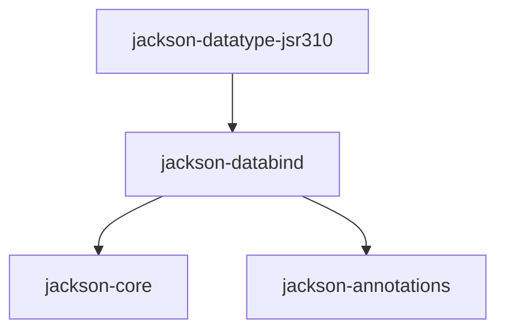

## 简介
jackson是spring默认支持的json序列化工具, 通常来说, 核心的三个jar包:`jackson-core`,`jackson-annotations`,`jackson-databind`,还有包括支持不同数
据类型的插件,比如jdk8中的时间格式(如LocalDate,LocalDateTime等)的插件`jackson-datatype-jsr310`等等,他们的依赖关系如图:

所以原则上来说,我们只要引入jackson-datatype-jsr310的jar包就行了,实际项目说,核心的三个包需不需要声明式的重复引入,取决于所在项目或者公司的规范,
不过遵照单一性原则,个人喜欢每个jar包都声明式的引入,当然,如果是接口-服务(api-service)分离的项目,在接口层,我们往往只需要引入`jackson-annotations`即可.

## jackson的使用
```java
//先定义两个pojo类
//POJO
@Setter
@Getter
@AllArgsConstructor
@NoArgsConstructor
public static class User {
    private String name;
    private Integer age;
    private Car car;
}

//POJO
@Setter
@Getter
@AllArgsConstructor
@NoArgsConstructor
public static class Car {
    private String name;
    private String brand;
}
```
### 最简单序列化
```groovy
ObjectMapper objectMapper = new ObjectMapper;
User walkvoid = new User("walkvoid", 18, new Car("my baby cat", "benz"));

//result is a string variable
String walkvoid1 = objectMapper.writeValueAsString(walkvoid);
// {"name":"walkvoid","age":18,"car":{"name":"my baby cat","brand":"benz"}}


//wirite json to file
objectMapper.writeValue(new File("/path/destination-fileName.txt"), walkvoid);
```
jackson根据输出的不同,可以将json结果作为字符串输出,写到文件中或者写到输出流中等等.

### 最简单反序列化
```groovy
String walkvoidJson = "{\"name\":\"walkvoid\",\"age\":18,\"car\":{\"name\":\"my baby cat\",\"brand\":\"benz\"}}";

//json to java bean
User user = objectMapper.readValue(walkvoidJson, User.class);

//json to list
String listJson = "[\"A\", \"B\", \"C\"]";
List list = objectMapper.readValue(listJson, List.class);

//java bean's json to map
Map<String, Object> map = objectMapper.readValue(walkvoidJson, Map.class);
//map instanceof LinkedHashMap, map.get("car") also instanceof LinkedHashMap


//json to tree
JsonNode jsonNode = objectMapper.readTree(walkvoidJson);
//jsonNode instanceof ObjectNode, jsonNode is root node
JsonNode brandNode = jsonNode.at("/car/brand");
String s = brandNode.asText();
//s == "benz"
```
jackson可以将json字符串反序列化成java bean, List或者Map,甚至还可以反序列化为最基础的树结构JsonNode,此时返回的是树的根节点,jackson支持文件
路径式的访问该树下的任意节点,正如你所看到上述例子中的"/car/brand",其中最开始的"/"表示根节点.
JsonNode是一个顶级接口,其类图如下:
