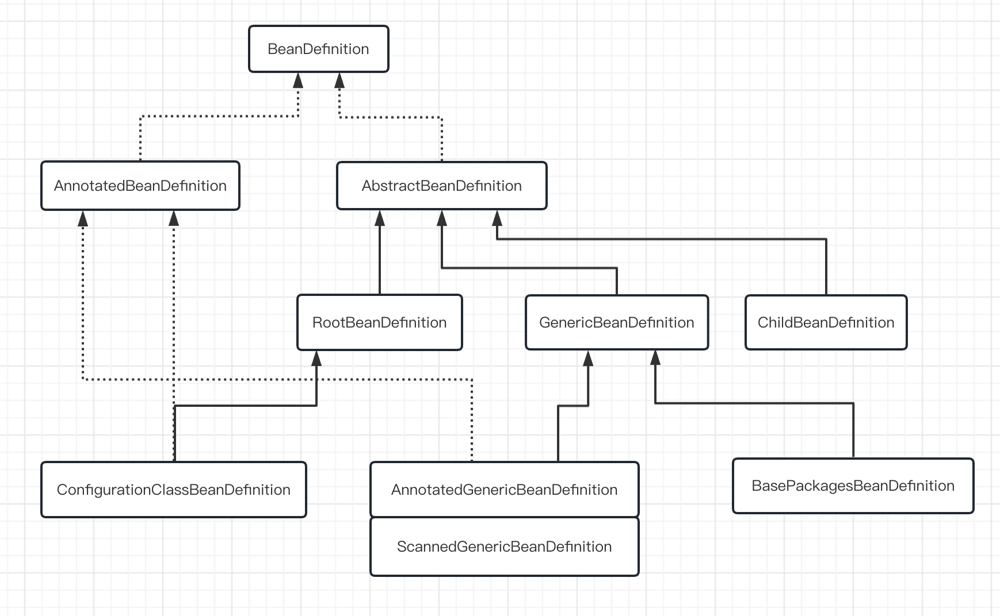

# spring bean的种类
## 简介
我们知道，应用程序的bean会被spring的BeanDefinition实例包裹，BeanDefinition描述了一个 Bean 实例: 该实例具有属性值、构造函数参数值
以及具体实现提供的其他信息。BeanDefinition是一个接口，根据不同的用途BeanDefinition有很多的子类。
主要的一些类继承图如下：


- BeanDefinition：是一个顶级接口，包含了很多操作BeanDefinition的方法。
```java
public interface BeanDefinition extends AttributeAccessor, BeanMetadataElement {
    
    int ROLE_APPLICATION = 0; //应用程序的bean
    int ROLE_SUPPORT = 1;     //
    int ROLE_INFRASTRUCTURE = 2; //
    //设置scope
    void setScope(@Nullable String scope);
    //设置是否懒加载
	void setLazyInit(boolean lazyInit);
    //设置依赖的bean
	void setDependsOn(@Nullable String... dependsOn);
    //设置是否自动注入
	void setAutowireCandidate(boolean autowireCandidate);

}
```

- GenericBeanDefinition 通用的

