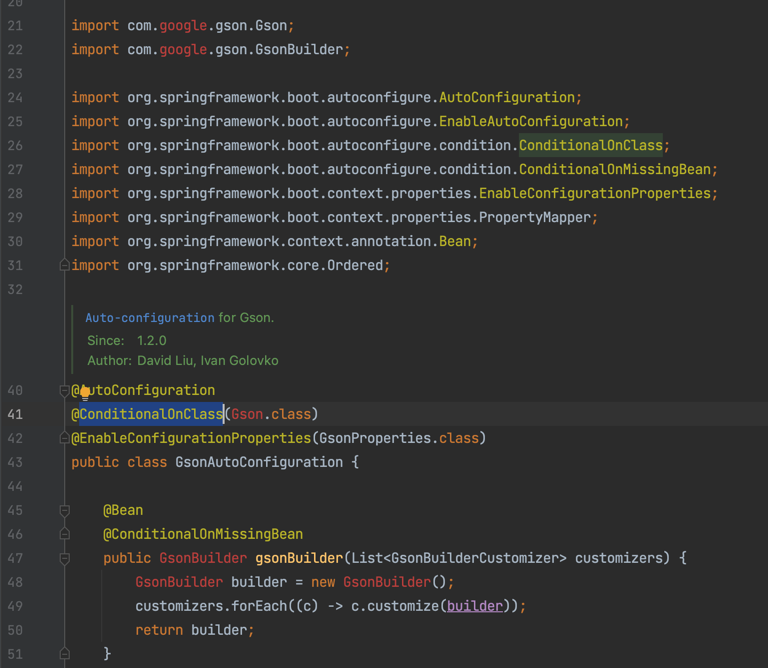

# 自动配置选择依赖组件
## 简介
我们在编写自动配置类的时候，有一个很常见的场景:我们的自动配置类依赖一个抽象的组件，而这个组件有多个实现，实际要注入哪个组件实现类，取决于
用户的的环境（比如引入了哪个组件实现的包），那springboot是如何处理这种场景的的。
一个我们常见的例子:
```java
@AutoConfiguration(
		after = { GsonAutoConfiguration.class, JacksonAutoConfiguration.class, JsonbAutoConfiguration.class })
@ConditionalOnClass(HttpMessageConverter.class)
@Conditional(NotReactiveWebApplicationCondition.class)
@Import({ JacksonHttpMessageConvertersConfiguration.class, GsonHttpMessageConvertersConfiguration.class,
		JsonbHttpMessageConvertersConfiguration.class })
public class HttpMessageConvertersAutoConfiguration {
    //省略

}
```
JsonbHttpMessageConvertersConfiguration用来处理web应用程序，将外部http请求的json数据转换成java对象，其中用到了外部的json工具类，
支持Gson，jackson，json-b三种不同的实现。

## springboot的做法
1。针对每一种组件的不同组件实现，都编写其配置类GsonAutoConfiguration，JacksonAutoConfiguration和JsonbAutoConfiguration，在这三个自动
配置类里面，都有一个关键的注解@ConditionalOnClass，这个注解会搜索当前的class文件中是否有指定的class类，只有当用户引入了对应组件的jar
包，这个配置组件才会被激活，进而激活依赖这个配置组件的配置类（即HttpMessageConvertersAutoConfiguration）。

2。当我们打开我们未引入相关组件的配置，我们发现编译是失败的:


实际上，springboot在编写HttpMessageConvertersAutoConfiguration的时候，会将三个组件的包都引入，只不过引入的scope是compile(注意这
在maven的叫法，实际在springboot官方，使用的gradle来构建，springboot自己实现了groovy函数来实现类似的效果)，效果就是相关组件只有在编译
期生效，这就是为啥我们看到GsonAutoConfiguration编译失败，编译失败只是在你的本地失败，springboot官方在编写源码时可不会失败。

## @ConditionalOnClass底层
```java
@Target({ ElementType.TYPE, ElementType.METHOD })
@Retention(RetentionPolicy.RUNTIME)
@Documented
@Conditional(OnClassCondition.class)
public @interface ConditionalOnClass {
    
	Class<?>[] value() default {};
    
	String[] name() default {};
}
```
```java
@Target({ElementType.TYPE, ElementType.METHOD})
@Retention(RetentionPolicy.RUNTIME)
@Documented
public @interface Conditional {
    
	Class<? extends Condition>[] value();
}
```
```java
@FunctionalInterface
public interface Condition {
    
	boolean matches(ConditionContext context, AnnotatedTypeMetadata metadata);

}
```
@ConditionalOnClass是一个复合注解，它的基础注解是@Conditional，@Conditional支持传入一个Condition实现类，改实现类的matches方法返回
true表示允许将bean注入到spring容器中。

## @Conditional标注的地方
todo

## @Conditional解析处理
查看@Conditional注解使用的地方，可以定位到ConditionEvaluator类，断点到shouldSkip方法里面，查看调用栈，可以知道调用顺序：
```text
1.org.springframework.context.support.AbstractApplicationContext#refresh
2.org.springframework.context.support.AbstractApplicationContext#invokeBeanFactoryPostProcessors
3.org.springframework.context.support.PostProcessorRegistrationDelegate#invokeBeanFactoryPostProcessors
4.org.springframework.context.support.PostProcessorRegistrationDelegate#invokeBeanDefinitionRegistryPostProcessors
5.org.springframework.beans.factory.support.BeanDefinitionRegistryPostProcessor#postProcessBeanDefinitionRegistry
6.org.springframework.context.annotation.ConfigurationClassPostProcessor#processConfigBeanDefinitions
7.org.springframework.context.annotation.ConfigurationClassParser#doProcessConfigurationClass
8.org.springframework.context.annotation.ComponentScanAnnotationParser#parse
```
可知，@Conditional解析处理也是在BeanFactoryPostProcessor的子类ConfigurationClassPostProcessor中处理的，处理@Conditional的逻辑
和处理其他注解(如@ComponentScan)的逻辑耦合在一起，不过最终都是调用到ConditionEvaluator类里面，@Conditional说白了就是决定某个bean是否要注入到spring容器中
